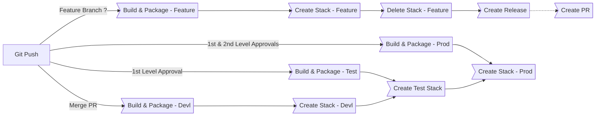
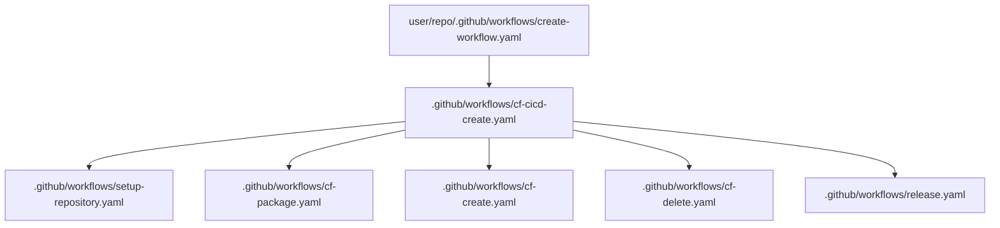
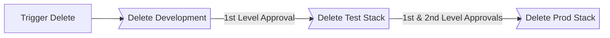
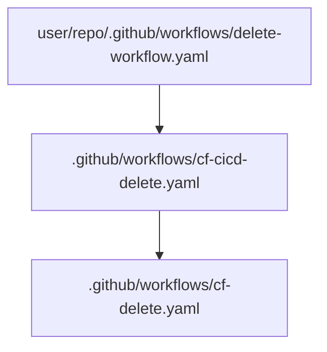

&nbsp;&nbsp;&nbsp;&nbsp;&nbsp;&nbsp;&nbsp;&nbsp;

## CI/CD Workflow Create and Deploy Stack



### To use the pipeline in your repository create a create-stack.yaml file in .github/workflows

```yaml
name: Parent CI-CD Workflow

on:
  push:

permissions:
  id-token: write       # This is required for aws oidc connection
  contents: read        # This is required for actions/checkout
  pull-requests: write  # This is required for gh bot to comment PR
  issues: write

jobs:
  cf-cicd:
    name: CI-CD
    uses: subhamay-bhattacharyya/gh-action-reusable-aws-cfn-wf/.github/workflows/create-pipeline.yaml@main
    with:
      deploy-reviewer-test: <GitHub User Id for Test Environment>
      deploy-reviewer-prod: <GitHub User Id for Test Environment>
      pr-approver: <GitHub User for Pull Request>

```
## Reusable nested workflows



## CI/CD Workflow Delete Stack




### To use the pipeline in your repository create a delete-stack.yaml file in .github/workflows

```yaml
name: Parent CI-CD Workflow

on:
  push:

permissions:
  id-token: write                       # This is required for aws oidc connection
  contents: read                        # This is required for actions/checkout
  pull-requests: write                  # This is required for gh bot to comment PR
  issues: write

jobs:
  cf-cicd:
    name: CI-CD
    uses: subhamay-bhattacharyya/gh-action-reusable-aws-cfn-wf/.github/workflows/cf-cicd-delete.yaml@main
```

## Reusable nested workflows



### Setting up the CI/CD Pipeline


* This repository is configured to deploy the stack in Development, Staging and Production AWS Accounts. To use the pipeline you need to have
three AWS Accounts created in an AWS Org under a Management Account (which is the best practice). The Org structure will be as follows:

```
Root
├─ Management
├─ Development
├─ Test
└─ Production
```

* Create KMS Key in each of the AWS Accounts which will be used to encrypt the resources.

* Create an OpenID Connect Identity Provider

* Create an IAM Role for OIDC and use the sample Trust Policy in each of the three AWS accounts
```
{
    "Version": "2008-10-17",
    "Statement": [
        {
            "Effect": "Allow",
            "Principal": {
                "Federated": "arn:aws:iam::<Account Id>:oidc-provider/token.actions.githubusercontent.com"
            },
            "Action": "sts:AssumeRoleWithWebIdentity",
            "Condition": {
                "StringLike": {
                    "token.actions.githubusercontent.com:sub": [
                        "repo:<GitHub User>/<GitHub Repository>:ref:refs/head/main",
                    ]
                }
            }
        }
    ]
}
```

  * Create an IAM Policy to allow CloudFormation access and attach it to the OIDC Role, using the sample policy document:
```
{
    "Version": "2012-10-17",
    "Statement": [
        {
            "Effect": "Allow",
            "Action": [
                "cloudformation:CreateStack",
                "cloudformation:DescribeStacks",
                "cloudformation:CreateChangeSet",
                "cloudformation:DescribeChangeSet",
                "cloudformation:DeleteChangeSet",
                "cloudformation:ExecuteChangeSet",
                "cloudformation:DeleteStack",
                "cloudformation:DescribeStackEvents"
            ],
            "Resource": "*"
        }
    ]
}
```

* CloudFormation Parameter naming convenstion:
**The following parameters must be present in the CloudFormation Template for the CI/CD pipeline to work:**
    - ProjectName
    - Environment
    - GitHubRef
    - GitHubURL
    - GitHubWFRunNumber
    - GitHubSHA
    - GitHubRepository
    - CiBuild

**Lambda Name and Version Parameter**
    - The lambda function base name parameter should be **[_Some Prefix_]LambdaFunctionBaseName**. The prefix is required if the root template is used to create multiple lambda functions., e.g **ProcessingLambdaFunctionBaseName**
    - For each lambda function name parameter there should be a parameter named as **[_Some Prefix_]LambdaFunctionVersionId**. The prefix should be same as the lambda function name prefix.  Make the parameter as not null and pass some dummy value.The correct version id will be picked bu by the pipeliene.

* Repository Directory Structure
```
tarius-repo/
├─ .git
├─ .github/
│  ├─ workflows/
│  │  ├─ delete-stack.yaml  (**created by the template)
│  │  ├─ deploy-stack.yaml  (**created by the template)
├─ architecture-diagram/
│  ├─ project-architecture-diagram.png
├─ cft/
│  ├─ project-root-stack.yaml
├─ src/
│  ├─ lambda-function-base-name.py
├─ data/
│  ├─ data-file.csv (test data)
├─ kms-policy/
│  ├─ kms-key-policy.json (required for documentation purpose only)
├─ params/
│  ├─ cfn-parameters.json
├─ .gitignore
├─ README.md

```

* Create three repository environments in GitHub (devl, test, prod)

* Create the following GitHub repository Secrets:


|Secret Name|Secret Value|
|-|-|
|AWS_REGION|```us-east-1```|
|DEVL_AWS_KMS_KEY_ARN|```arn:aws:kms:<AWS Region>:<Development Account Id>:key/<KMS Key Id in Development>```|
|TEST_AWS_KMS_KEY_ARN|```arn:aws:kms:<AWS Region>:<Test Account Id>:key/<KMS Key Id in Test>```|
|PROD_AWS_KMS_KEY_ARN|```arn:aws:kms:<AWS Region>:<Production Account Id>:key/<KMS Key Id in Production>```|
|DEVL_AWS_ROLE_ARN|```arn:aws:iam::<Development Account Id>:role/<OIDC IAM Role Name>```|
|TEST_AWS_ROLE_ARN|```arn:aws:iam::<Test Account Id>:role/<OIDC IAM Role Name>```|
|PROD_AWS_ROLE_ARN|```arn:aws:iam::<Production Account Id>:role/<OIDC IAM Role Name>```|
|DEVL_CODE_REPOSITORY_S3_BUCKET|```<Repository S3 Bucket in Development>```|
|TEST_CODE_REPOSITORY_S3_BUCKET|```<Repository S3 Bucket in Test>```|
|PROD_CODE_REPOSITORY_S3_BUCKET|```<Repository S3 Bucket in Production>```|

### Executing the CI/CD Pipeline

* Create Create a feature branch and push the code.
* The CI/CD pipeline will create a build and then will deploy the stack to devlopment.
* Once the Stage and Prod deployment are approved (If you have configured with protection rule ) the stack will be reployed in the respective environments